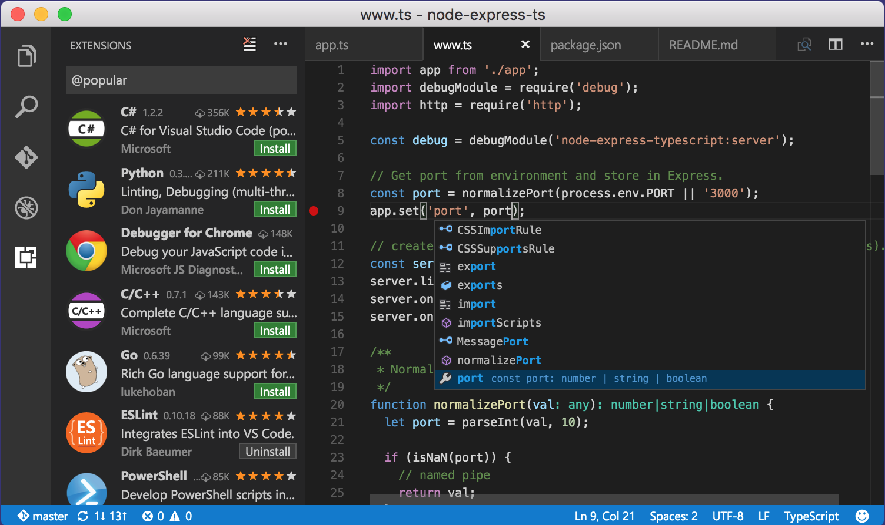

# Development Environment
<small>by Peter Cosemans</small>
<br>
<br>
<small>
Copyright (c) 2018 Euricom nv. Licensed under the [MIT license](https://opensource.org/licenses/MIT).
</small>

<style type="text/css">
.reveal pre code {
    display: block;
    padding: 5px;
    overflow: auto;
    max-height: 800px;
    word-wrap: normal;
}
</style>

---

# GIT

Git is used everywhere

- All open source projects
- All JavaScript libraries
- Default support in IDE & editors
- All npm modules are stored from github
- All content of this workshop :)

----

# GIT

Clone this repo

```
mkdir git
cd git
git clone https://github.com/Euricom/training-workshop-JS-VUE-jan2018.git
cd training-workshop-JS-VUE-jan2018
```

Get latest version of repo

```
cd training-workshop-JS-VUE-jan2018
git pull
```

----

# GIT

3th party git tools

- [SourceTree](https://www.sourcetreeapp.com/)
- [Gitkraken](https://www.gitkraken.com/)

---

# Markdown

> The text format for developers

----

# Markdown

All slides and documentation is placed in markdown

```markdown
# Header 1
## Header 2

Unordered

+ Create a list by starting a line with `+`, `-`, or `*`
+ Sub-lists are made by indenting 2 spaces

Ordered

1. Lorem ipsum dolor sit amet
2. Consectetur adipiscing elit
3. Integer molestie lorem at massa

Ordered

1. Lorem ipsum dolor sit amet
2. Consectetur adipiscing elit
3. Integer molestie lorem at massa

...
```

[See Also](https://guides.github.com/features/mastering-markdown/) and [here](https://github.com/adam-p/markdown-here/wiki/Markdown-Cheatsheet)

----

# Markdown

Tools

- [VSCode](https://code.visualstudio.com/)
- http://markdownpad.com
- https://caret.io/

Online Tools

- https://dillinger.io/
- https://stackedit.io/editor


---

# VSCode

> Powercharge your development environment

----

### Code Editing Redefined

Free, Open Source, Runs everywhere



[Visual Studio Code](https://code.visualstudio.com/)

----

## Plugins - Must have

| Plugin                    | Remark                             |
| ------------------------- | -----------------------------------|
| EditorConfig for VS Code  | -                                  |
| Prettier - Code Formatter | Formats code                       |
| ESLint                    | Validates javascript code          |
| vetur                     | Vue tooling                        |
| Path Intellisense         | Autocompletes files                |
| Color Highlight           | Highlights colors                  |

----

## Plugins - Usefull

| Plugin                    | Remark                           |
| ------------------------- | ---------------------------------|
| Git History (git log)     | Git commits logs                 |
| Git Blame                 | See Git Blame info in status bar |
| Bracket Pair Colorizer    | Show open/close brackets         |
| Document This             | JSDoc comments                   |
| TODO Highlight            | Highlight TODO's                 |

----

## Custom config

Goto `preferences - user settings`

```json
{
    // auto save on close
    "files.autoSave": "onFocusChange",

    // let ESlint validate my JS code
    "javascript.validate.enable": false,

    // linting vue files
    "files.associations": {
        "*.vue": "vue"
    },
    "eslint.options": {
        "extensions": [".js", ".vue"]
    },
    "eslint.validate": ["javascript", "vue"],
}
```

---

# Node Package Manager (NPM)

> Like NuGet but for JavaScript

----

## Node Package Manager (NPM)

```bash
# versions
$ node --version      # node runtime version
$ npm --version       # package manager version
```

Install tools

```bash
# to install a module globally
npm install vue-cli -g         # vue command line tools
npm install lite-server -g     # http server
npm install json-server -g     # json (REST API) server
npm install reveal-md -g       # markdown slides presentation
```

----

## Local installs

Npm is also used to install local tools/libraries

```bash
# to start (create a package.json: definition of all
# packages/modules in this project)
npm init
```

package.json

```bash
{
  "name": "base",
  "version": "1.0.0",
  "scripts": {
    "test": "echo \"Error: no test specified\" && exit 1"
  },
  "license": "MIT",
  ...
}
```

install

```bash
# to install a module locally
npm install eslint        # local eslint tool
npm install jquery        # ES6 module

# to remove a module
npm uninstall jquery
```

----

## Exclude from Source Control

A ```node_modules``` folder can become big fast <br>(base/node_modules: 27,6 MB, 3209 files), so always ignore it:

.gitignore

```
node_modules/
```

For a new developer (or build server)

```bash
# to install all modules defined in the package.json
npm install
```

---

# Linting

> Don't start a javascript project without a linter!

----

## ESLint

The pluggable linting utility for JavaScript and JSX

<br>

----

## IDE/Editor Support

Any good JS editor support's linting

- Visual Studio Code
- Visual Studio
- WebStorm
- Atom

<br>

----

## Setup

```bash
# install
npm install eslint                      # linter engine
npm install eslint-config-airbnb-base   # linter configuration (airbnb)
```

.eslintrc

```json
{
  "extends": [
    "airbnb-base",
  ],
  "globals": {},
  "env": {
    "es6": true,
    "node": true
  },
  "rules": {
    "no-console": [0, ""], // allow console.log
  }
}
```

package.json

```json
scripts: {
    # simple commands
    "lint": "eslint \"**/*.js\""
}
```

<small>This setup follow the airbnb styleguide: https://github.com/zalmoxisus/javascript</small>

---

<image src="./images/prettier.png"><image>

Prettier is an opinionated code formatter. It format this

```js
foo(reallyLongArg(), omgSoManyParameters(), IShouldRefactorThis(),
isThereSeriouslyAnotherOne(), "actionName")
```

to

```js
foo(
  reallyLongArg(),
  omgSoManyParameters(),
  IShouldRefactorThis(),
  isThereSeriouslyAnotherOne(),
  'actionName',
);
```

Resources

- [Prettier Official WebSite](https://prettier.io/)
- [VSCode Plugin](https://marketplace.visualstudio.com/items?itemName=remimarsal.prettier-now)

---

# Combine it all

You can use ```./templates/base``` as a base for javascript projects

```bash
./templates/base
├── .editorconfig
├── .eslintrc
├── .prettierrc
├── index.html
├── main.js
└── package.json
```

package.json

```json
{
  "name": "base",
  "version": "1.0.0",
  "description": "",
  "scripts": {
    "serve": "lite-server .",
    "lint": "eslint \"**/*.js\"; exit 0",
    "format": "prettier --write '**/*.{js,css}'"
  },
  "license": "MIT",
  "private": true,
  "devDependencies": {
    "eslint": "^4.15.0",
    "eslint-config-airbnb-base": "^12.1.0",
    "eslint-config-prettier": "^2.9.0",
    "eslint-plugin-import": "^2.8.0",
    "prettier": "^1.9.2"
  }
}

```

----

## Available scripts

```bash
# start webserver with index.html
npm run serve

# format code
npm run format

# lint code
npm run lint
```
