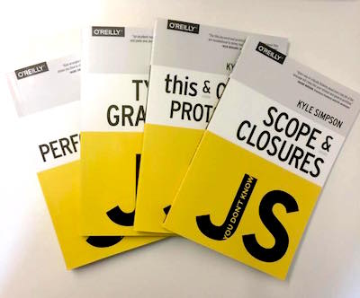

# Know your javascript
<small>by Peter Cosemans</small>
 
 
<small>
Copyright (c) 2018 Euricom nv. Licensed under the [MIT license](https://opensource.org/licenses/MIT).
</small>

---

# Learn Javascript

 

> https://github.com/getify/You-Dont-Know-JS

---

----

## JavaScript Versions

- JavaScript
- ECMAScript
- ECMAScript 5 (ES5) - 2009
- ECMAScript 6 (ES6/ES2015) - 2015
- ECMAScript 2016 (ES7) - 2016
- ECMAScript 2017 - 2017
- ES.Next
- TC39

Note:
- ECMAScript: A language standardized by ECMA International.
- JavaScript: The commonly used name for implementations of the ECMAScript standard
- ECMAScript 5 (ES5): The 5th edition of ECMAScript, standardized in 2009
- ECMAScript 6 (ES6/ES2015): The 6th edition of ECMAScript, standardized in 2015.
- ECMAScript 2016: The 7th edition of ECMAScript

----

## ES6+ Today

 

- Edge, Chrome, Firefox and Safari: +95%
- Node 8.x: +98%

> [http://kangax.github.io/compat-table/es6/](http://kangax.github.io/compat-table/es6/)

