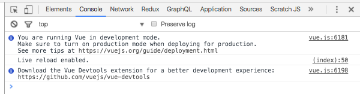
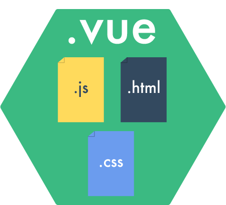

# VueJS Introduction
<br>
<small>by Peter Cosemans</small>
<br>
<br>
<small>
Copyright (c) 2018 Euricom nv. Licensed under the [MIT license](https://opensource.org/licenses/MIT).
</small>

<style type="text/css">
.reveal pre code {
    display: block;
    padding: 5px;
    overflow: auto;
    max-height: 800px;
    word-wrap: normal;
}
</style>

---

# The world of VueJS

| Product                            | Description                             |
| ---------------------------------- | --------------------------------------- |
| [Vue.js](https://vuejs.org/)       | The Progressive JavaScript Framework    |
| [Vuex](https://vuex.vuejs.org/en/) | Centralized State Management for Vue.js |
| [Nuxt](https://nuxtjs.org/)        | Universal Vue.js Applications (SSR)     |

<br>

[https://github.com/vuejs/awesome-vue](https://github.com/vuejs/awesome-vue)

---

# Quick Start

> Easy does it.

----

## My first app

index.html
```html
<!DOCTYPE html>
<html lang="en">
  <head>
    <title>My First Vue</title>
  </head>
  <body>
    <!-- begin vue template -->
    <div id="app">
      {{ message }}
    </div>
    <!-- end vue template -->

    <script src="https://unpkg.com/vue@2.5.11/dist/vue.js"></script>
    <script src="main.js"></script>
  </body>
</html>
```

main.js

```js
new Vue({
    el: '#app',
    data() {
        return {
          title: 'My First App',
          message: 'Hello Vue'
        }
    }
})
```

Note:
- The `el` property binds to the `app` div.
- The `data` function returns an object where the properties are available in the template'

----

## Magic 2 way data binding

Lets add an input element to the page

```html
<div id="app">
    <input type="text" id="input" v-model="message">
    <p>The Value of the input is: {{message}}</p>
</div>
```

Run and type something in the box...

> This gives us 2-way binding with the ```v-model``` directive and output binding with ```{{...}}```.

Note:
- See the `v-model` attribute. This is a special vue extension that gives us 2-way binding.


----

## Devtools

Open devtools and notice the following message:



[Get it on the Chrome Web Store](https://chrome.google.com/webstore/detail/vuejs-devtools/nhdogjmejiglipccpnnnanhbledajbpd)

You can inspect the Vue components and interact with them. See also the $vm0 (and others)
variabled to inpect or change via the console.

> Single root of truth: the view, the data, the console, the devtools.

---

# Using .vue files
> The modern way of writing vue applications

<br>

----

## Combining template and script

app.vue
```html
<template>
  <div>
    <h2>My First Component</h2>
    {{ title }}
  </div>
</template>

<script>
export default {
  name: 'app',
  data() {
    return {
      title: 'hello Vue',
    };
  },
};
</script>
```

main.js

```js
import Vue from 'vue';
import App from './App.vue';

new Vue({
  el: '#app',
  render: h => h(App),
});
```

Note: Mark we are using ES Module syntax here.

----

## Use a module bundler

The browser doesn't understand:
- .vue files
- import / export
- ES modules

So

> To work with .vue files you must use a bundler (eg; webpack) that read vue files and translate it to ES5

----

## Vue-CLI

Easiest way to start with .vue files

```bash
$ npm install vue-cli -g
$ vue init webpack-simple myapp
? Project name myapp
? Project description A Vue.js project
? Author Peter Cosemans <peter.cosemans@gmail.com>
? License MIT
? Use sass? No

   vue-cli · Generated "myapp".

   To get started:

     cd myapp
     npm install
     npm run dev
```

[Official templates](https://github.com/vuejs/vue-cli#official-templates)

or

See ['./templates/base-vue-esm'](https://github.com/Euricom/training-workshop-JS-VUE-jan2018/tree/master/templates/base-vue-esm)

---

# Styling
> Power-up your styling

----

## Styling in .vue file

```html
<!-- message.vue -->
<template>
  ...
</template>

<script>
  ...
</script>

<style>
h1 {
    color: red
}
</style>
```

Notice that the style is applied to the full application

----

## Scoped styling

```html
<!-- message.vue -->
<style scoped>
h1 {
    color: red
}
</style>
```

Notice that the styling is now  applied to the `Message` component only.

----

## Using less or sass

```html
<style lang="less">
@import "~bootstrap/dist/css/bootstrap.css";
@import (reference) "../variable.less"
@alert-color: red
h1 {
    color: @alert-color
}
</style>
```

> You need to configure webpack to add less support

---

# Binding

> Connect your model to the view

----

## Value Binding

Simple binding (mustaches)

```html
<p>The Value of the input is:
    <span>{{message}}</span>
</p>
```

`v-text` directive

```html
<p>The Value of the input is:
    <span v-text="message"></span>
</p>
```

`v-html` directive

```html
<div v-html="rawHtml"></div>
```

Using javascript expressions

```html
{{ number + 1 }}
{{ ok ? 'YES' : 'NO' }}
{{ message.split('').reverse().join('') }}
```

----

## List Binding

Create a list

```js
data() {
    return {
        message: 'Hello World',
        names: ['Joe', 'Mary', 'Jane', 'Jack'],
    }
},
```

Use the `v-for` directive

```html
<div id="app">
    <ul>
        <li v-for="name in names">{{name}}</li>
    </ul>
</div>
```

> You can inpect the array in the devTools

----

## Conditional Rendering

`v-if` and `v-else` directive

```html
<div v-if="Math.random() > 0.5">
  Now you see me
</div>
<div v-else>
  Now you don't
</div>
```

`v-show`  directive

```html
<h1 v-show="ok">Hello!</h1>
```

> `v-show` is using CSS to show/hide content, `v-if` removes the content from the dom.

----

## Attributes Binding

Set button title

```html
<button title="hit me">Add</button>
```

Set button title at runtime: `:title` syntax (v-bind` directive)

```js
data() {
    return {
        names: ['Joe', 'Mary', 'Jane', 'Jack'],
        buttonTitle: 'Click me to add a name',
    }
}
```

```html
<button :title="title">Add</button>
```

You can set any attribute this way (see [MDN](https://developer.mozilla.org/nl/docs/Web/HTML/Global_attributes))

----

## Attributes Binding

Use it for classes

```html
<button :class="buttonClass">Add</button>
```

```js
data() {
    return {
        buttonClass: 'active'
    }
}
```

Conditional Class binding

```html
<style>
  .is-loading { background: red; }
</style>

<button :class="{ 'is-loading': isLoading }">
```

```js
data() {
    return {
        ...
        isLoading: false,
    }
}
```

> More: https://vuejs.org/v2/guide/class-and-style.html

----

## Computed properties

```html
<span>{{now}}</span>
<ul>
    <li v-for="item in incompleteTasks">
        {{item.description}}
    </li>
</ul>
```

```js
data() {
  tasks: [
    { id: 1, name: 'coding', complated: false}
    { id: 2, name: 'reading', complated: true}
  ]
},
computed: {
    now() {
        return new Date()
    }
    incompleteTasks() {
        return this.tasks.filter(task => !task.completed)
    }
}
```

In the computed property you can access the data via the 'this' reference.

---

# Events

> React to user input

----

## Listening to events

Use `@click` syntax

```html
<!-- `greet` is the name of a method defined below -->
<button @click="greet($event)">ClickMe</button>
```
Event Handler

```js
var example2 = new Vue({
    ...
    data() {
        return {
            name: 'Vue.js'
        },
    },
    // define methods under the `methods` object
    methods: {
        greet(event) {
            // `this` inside methods points to the Vue instance
            alert('Hello ' + this.name + '!')
            // `event` is the native DOM event
            console.log(event.target.tagName)
        }
    }
})
```

You can response to any event (see [MDN](https://developer.mozilla.org/en-US/docs/Web/Events))

----

## Event modifier

It is a very common need to call `event.preventDefault()` or `event.stopPropagation()` inside event handlers.

```js
methods: {
    greet: function (event) {
        event.preventDefault()
        ...
    }
}
```

Simplified

```html
<a @click.prevent="greet($event)"></a>
```

Key modifiers:

```html
<!-- only call vm.submit() when the keyCode is 13 -->
<input v-on:keyup.13="submit">
```

More: https://vuejs.org/v2/guide/events.html#Event-Modifiers

---

# Exercise

> Use a button to toggle (hide/show) a paragraph of text

- Look for 3 solutions

---

# Components

> The power of VueJS

----

## What are components

In a large application, it is necessary to divide the whole app into components to make development manageable.  So a component is a re-usable UI components.

```html
<div id="app">
  <app-nav></app-nav>
  <app-layout>
    <app-sidebar></app-sidebar>
    <app-content>
      ...
    </app-content>
  </app-layout>
</div>
```

> It's like extending your html

----

## How to create

myComponent.vue

```html
<template>
  <div>
    <h2>My Component</h2></H2>
  </div>
</template>
<script>
export default {
  // ...
}
</script>
```

app.vue

```html
<template>
  <my-component></my-component>
</template>
<script>
import MyComp from './myComponent.vue'
export default {
  components: {
    // list the components used in this component
    MyComponent,
  },
  data () {
    ...
  }
}
</script>
```

Note: Notice the CamelCase to kebab-case translation

----

## Slots

Slots are used to pass all the inner content (like inner html).

myComponent.vue

```html
<template>
  <div>
    <h1>{{title}}</h1>
    <slot></slot>
  </div>
</template>
<script>
  export default {
    ...
  }
</script>
```

And use it

```html
<div id="root">
  <my-component>
    <span>Add some text here</span>
  </my-component>
</div>
```

----

## Custom attributes: props

I want to set my title on the component

```html
<div id="app">
  <my-component title="My Component Title" number="5">
    <span> Add some text here </span>
  </my-component>
</div>
```

In code (props becomes available in template)

```html
<template>
  <div>
    <h1>{{title}}</h1>
    <h3>{{number}}</h3>
    <slot></slot>
  </div>
</template>
<script>
export default {
  props: ['title', 'number'],
  data() {
    ...
  }
}
</script>
```

More https://vuejs.org/v2/guide/components.html#Prop-Validation

----

## Dynamic props

You can use `:syntax` on the custom properties

```html
<my-component :title="title" :number="number">
    <span> Add some text here </span>
</my-component>
```

----

## Custom events

```js
<template>
  <div>
      <h1>My Super Button</h1>
      <button @click="onClick()">Finish</button>
  </div>
</template>
<script>
export {
  data() {
  },
  methods: {
    onClick() {
        this.$emit('handled', { id: 123 })
    }
}
</script>
```

```html
<div id="root">
  <my-component @handled="onHandled($event)">
  </my-component>
</div>
```

---

# Filters
> Format your values

----

## Filters

Simple text formatting

```html
{{ message | toUpperCase }}

<div v-text="date | formatDate"></div>
```
Create a custom filter

```js
import Vue from "vue"
Vue.filter('toUpperCase', (value) => {
  if (!value) return ''
  return value.toString().toUpperCase()
})
```

Can take arguments

```html
{{ message | filterA('arg1', arg2) }}
```

Can be chained

```html
{{ message | filter1 | filter2 }}
```

VueJS 2.0 doesn't provide filters: [3th party package](
https://github.com/freearhey/vue2-filters)

---

## Lifecycle events

```js
export default {
  data() {
  },
  created() {
      // Instance is created
  },
  mounted() {
      // element is created in html
  },
  updated() {
      // Called after a data change
  },
  destroyed() {
      // Called after a Vue instance has been destroyed
  }
}
```

More: https://vuejs.org/v2/guide/instance.html#Lifecycle-Diagram

---

# Exercise

> Create dismissible bootstrap alert

- Use bootstrap styling: http://getbootstrap.com/components/#alerts-dismissible
- Create VueJS component

```html
    <!-- default alert: warning -->
    <alert>
        Almost out of stock
    </alert>

    <!-- custom alert with event -->
    <alert type="alert" @closed="onClosed()">
        <strong>Alert!</strong> We have a problem.
    </alert>
```

- Don't use jqeury or the bootstrap js library
- Log a message to the console if the dialog is closed

---

# Forms

> Get your user input

----

## Basic Usage

```html
<!-- text -->
<input v-model="message" placeholder="edit me">
<p>Message is: {{ message }}</p>
```
```html
<!-- checkbox -->
<input type="checkbox" id="checkbox" v-model="checked">
<label for="checkbox">{{ checked }}</label>
```
```html
<!-- radio -->
<input type="radio" id="one" value="One" v-model="picked">
<label for="one">One</label>
<br>
<input type="radio" id="two" value="Two" v-model="picked">
<label for="two">Two</label>
<br>
<span>Picked: {{ picked }}</span>
```
```html
<!-- select -->
<select v-model="selected">
    <option v-for="option in options" :value="option.value">
        {{ option.text }}
    </option>
</select>
<span>Selected: {{ selected }}</span>
```

<small>
For form validation see: [https://github.com/logaretm/vee-validate](https://github.com/logaretm/vee-validate)
</small>

----

## Form Submit

Form with bootstrap styling

```html
<form @submit.prevent="addUser">
  <div class="form-group">
    <label for="firstName">First Name:</label>
    <input type="text" class="form-control"
           id="firstName" v-model="user.firstName">
  </div>

  ... other

  <button class="btn btn-defaut" @click.prevent="$router.go(-1)">Back</button>
  <button type="submit" class="btn btn-default">Submit</button>
</form>
```

---

---

## App Events

> Communicating between components

----

Communicating between components with direct access

```js
    this.$root          // app root
    this.$parent        // parent component
    this.$children      // children components
```

> ***Warning***: Only use them when you know why you should.

----

## Event Bus

In simple scenarios, you can use an empty Vue instance as a central event bus.

```js
    var bus = new Vue();
```

In a component

```js
    bus.$emit('myEvent', 123)              // same instance
```

And listen for it

```js
    but.$on('myEvent', (value) => {
        ...
    })
```

----

## Event Aggregator

```js
class EventAggregator {
    constructor() {
        this.vue = new Vue()
    }

    fire(event, data = null) {
        this.vue.$emit(event, data)
    }

    listen(event, callback) {
        this.vue.$on(event, callback)
    }
}
export const eventAggregator = new EventAggregator()
```

Usage

```js
import { eventAggregator } from 'eventAggregator'

// component A
methods: {
    onClick() {
        eventAggregator.fire('myEvent', { ... })
    }
}

// component B
created() {
    eventAggregator.listen('myEvent', (value) => {
        console.log('handle it: ', value)
    })
}
```

---

# Resources

Learn

- [Learn Vue 2: Step By Step](https://laracasts.com/series/learn-vue-2-step-by-step)
- [Vue.js, Vuex, and Testing; an Introduction](http://tyronetudehope.com/2016/11/24/vue-js-vuex-testing-an-introduction)
- [VueJs: Filters](https://coligo.io/vuejs-filters/)
- [vueschool.io](https://vueschool.io)
